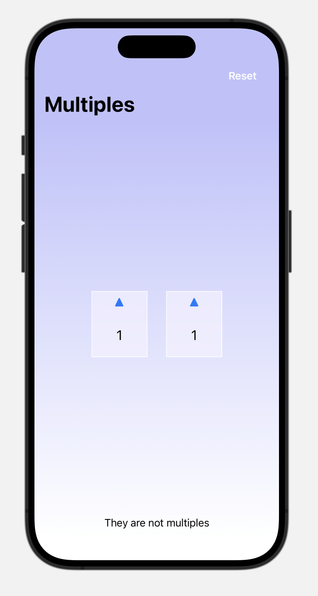

# Counter 

Counter app is an assignment to practice basic concepts

## Features

- **Buttons:** Learn how to create a buttons with some style
- **Gradient:** Explore the using of linearGradient.
- **Conditions:** Discover how to use the @State and @Binding property wrappers to maintain and manage the app's state, and practice conditions to do different actions

## Screenshots

## Technologies
- 💻 Swift
- 🖌️ SwiftUI## Color Reference

| Color             | Hex                                                                |
| ----------------- | ------------------------------------------------------------------ |
| Background color1 linear |  #c3c6f8 |
| Background color2 linear|  #ffffff |
| Background color1 linear multiples |  #eb4e3e |
| Background color2 linear multiples  |  #ffffff |

## Support

For support, email montserrat.ga95@gmail.com

## License

[MIT](https://choosealicense.com/licenses/mit/)

